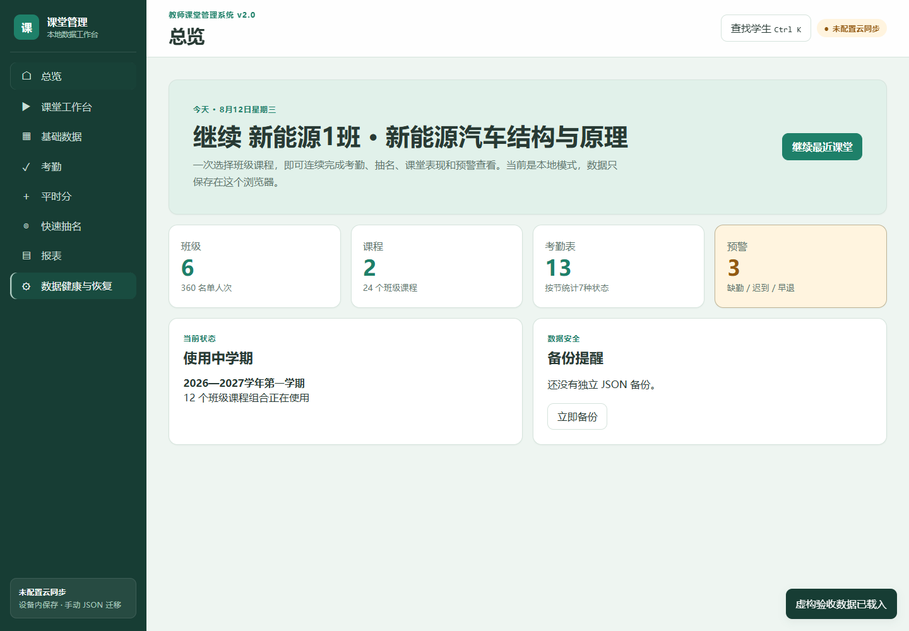
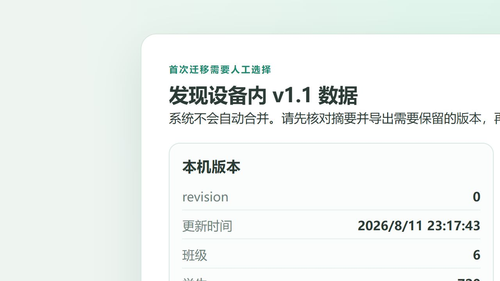
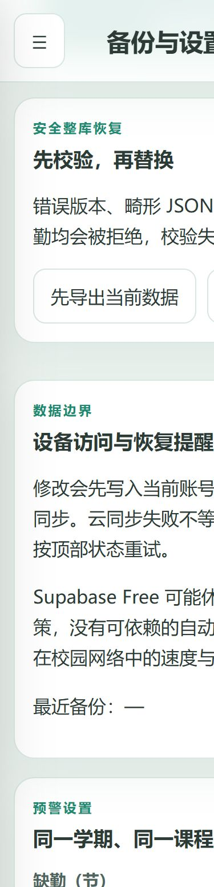
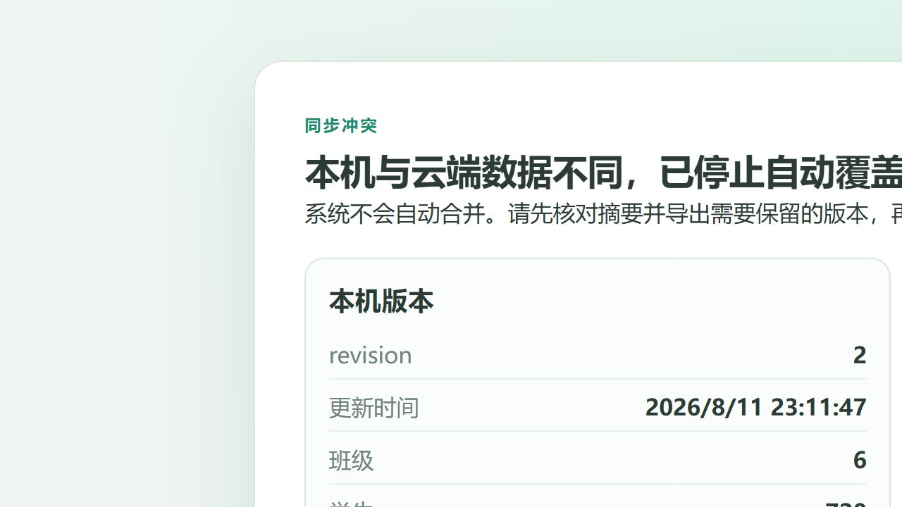
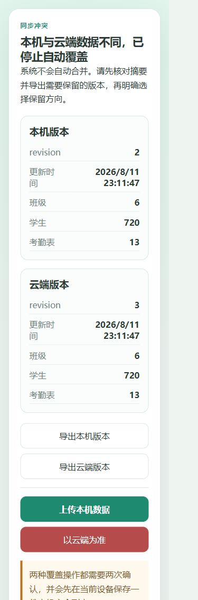
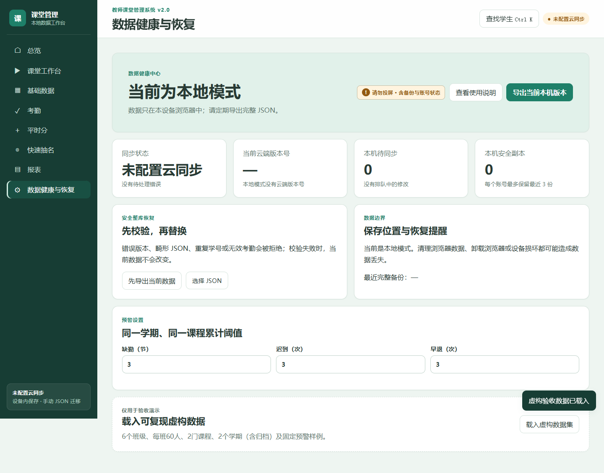
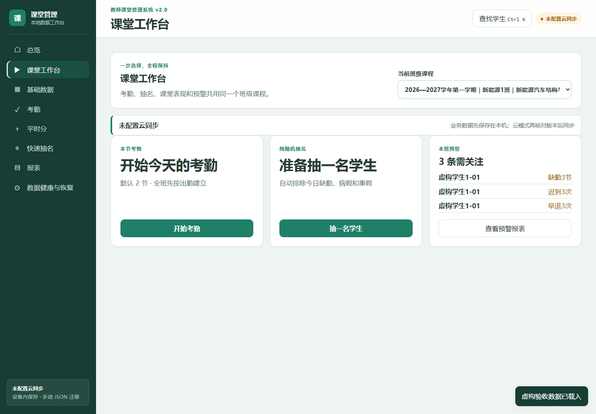
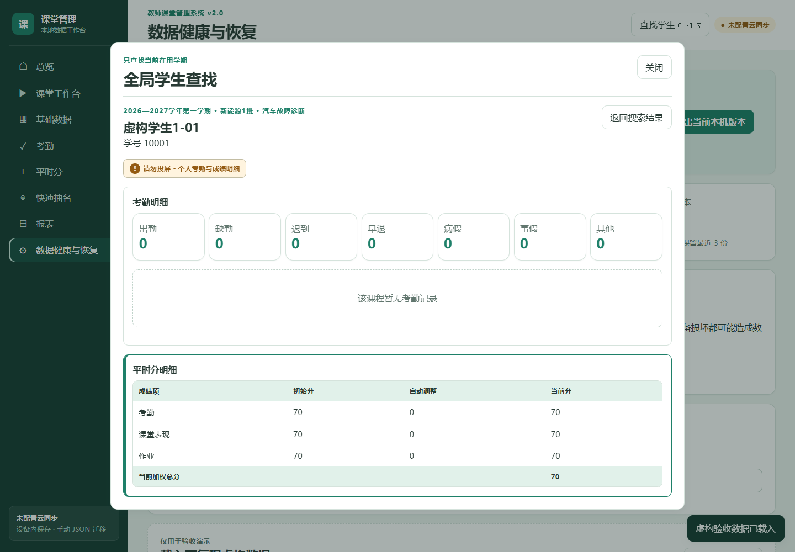
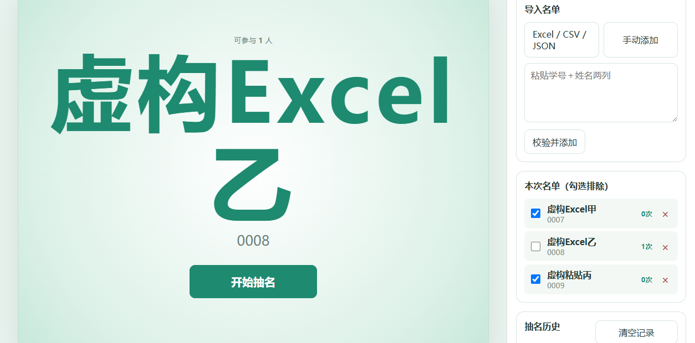

# 教师课堂管理系统 v2.0《使用与维护手册》

适用对象：使用 Windows、iPhone 或 iPad 记录课堂数据的教师。本文按最终界面文字说明操作，不要求具备编程知识。上线前只使用虚构学生数据演练。

## 1. 先理解系统边界

1. 主系统用于教师管理学期、班级、课程、名单、考勤、平时分、抽名和报表。
2. 系统有两种模式：
   - 页面顶部显示“未配置云同步”：只保存在当前浏览器，不需要账号，设备之间不同步。
   - 页面显示“登录课堂管理系统”：已配置教师账号，可把同一教师的数据在多台设备间同步。
3. 云同步只支持“同一教师账号的多设备”，不支持学生登录、教师之间共享班级或多人同时合并编辑。
4. 独立抽名单页是另一套完全离线的工具，与主系统不共享账号和存储。
5. 云同步不是自动备份承诺。无论使用哪种模式，都要定期进入“数据健康与恢复”，点“导出当前本机版本”。

未配置时的页面状态如下：

## 2. 第一次使用前准备

1. 决定先用“本地模式”还是“账号同步模式”。只在一台电脑使用时，本地模式最简单。
2. 准备班级名单。姓名是唯一必填项，学号可以留空；如果填写学号，系统会按文字保留 `001` 这类前导零。
3. 准备一份只含虚构学生的测试名单，先完整演练考勤、成绩、导出和恢复。
4. 给 Windows、iPhone、iPad 设置锁屏密码或生物识别。系统不代替设备锁屏。
5. 选定一个受保护文件夹，保存每周 JSON 备份和学期末报表。

## 3. 首次免费上线：Supabase + Cloudflare Pages

这部分通常由本校指定管理员完成一次。不要把任何密码、密钥或真实学生数据发给他人。

### 3.1 建立 Supabase Free 项目

1. 在 Supabase 官网注册并新建 Free 项目。
2. 数据库密码只保存在管理员自己的密码管理器，不写进项目文件、聊天、截图或说明文档。
3. 进入 Authentication 的登录设置，关闭公开自助注册。
4. 进入 SQL Editor，先执行 `supabase/migrations/20260811_teacher_database_sync.sql`。
5. 再执行 `supabase/migrations/20260812_v2_payload.sql`，把云端结构校验升级到 2.0。
6. 重复执行两份迁移，确认都没有报错；不要手工修改 RPC 的 `auth.uid()` 规则。
7. 在 Table Editor 检查 `teacher_databases` 和 `teacher_database_history` 都启用了 RLS。
8. 在项目 API 设置中只取 Project URL 和 publishable key。

> 风险提示：绝不能把 `service_role`、数据库密码或登录 token 放进前端变量。浏览器只允许使用 Project URL 与 publishable key。

### 3.2 创建教师账号

1. 进入 Authentication → Users。
2. 由管理员创建教师邮箱账号，不开放页面自助注册。
3. 为账号设置独立强密码，不与邮箱、校园平台或其他系统共用。
4. 第一次登录后，用第二台设备验证同一账号能看到相同的虚构数据。
5. 如教师离职或设备丢失，管理员应立即重置密码并检查活跃会话。

### 3.3 发布到 Cloudflare Pages

1. 在 Cloudflare Pages 中连接保存本项目的代码仓库。
2. 根目录填写 `classroom-manager`。
3. 构建命令填写 `npm ci && npm run build`。
4. 输出目录填写 `dist`。
5. Node.js 选择 22.13.0 或更高兼容版本。
6. 在 Pages 的构建变量中添加 `VITE_SUPABASE_URL` 和 `VITE_SUPABASE_PUBLISHABLE_KEY`。
7. 不要添加任何 `service_role`、数据库密码或账号密码。
8. 触发一次新部署，取得 Cloudflare 提供的 HTTPS 地址。
9. 先用虚构账号完成第 25 节的真实上线验收，再决定是否使用真实教学数据。

登录门的最终界面如下：

## 4. Windows 打开与安装 PWA

1. 用当前版 Edge 或 Chrome 打开管理员提供的 HTTPS 地址。
2. 本地模式会直接进入“总览”；账号同步模式会显示“登录课堂管理系统”。
3. 如需安装，在浏览器地址栏选择“安装此站点为应用”或浏览器菜单中的安装选项。
4. 安装完成后，从开始菜单打开“课堂管理”。
5. 第一次安装后保持联网到页面完全打开；2.0 会缓存约 1.71 MiB 的必要 JS/CSS，之后未打开过的工作台、数据健康和学生查找也可离线首次进入。
6. 不要把同一个部署地址放进公共电脑后长期保持登录。

## 5. iPhone / iPad 打开与安装 PWA

1. 必须使用 Safari 打开管理员提供的 HTTPS 地址。
2. 点 Safari 的“分享”按钮。
3. 向下找到“添加到主屏幕”。
4. 名称可保留“课堂管理”，点“添加”。
5. 回到主屏幕，从新图标打开系统并登录。
6. 第一次登录和第一次取得云端数据必须联网；取得有效缓存后，断网时才能继续记录。

> 风险提示：不要用电脑局域网的普通 HTTP 地址进行账号登录或 PWA 安装。iOS 在非安全地址下可能没有 Web Crypto，出现 `crypto.subtle` 相关错误；正式账号同步必须使用 HTTPS。清理 Safari 网站数据或卸载 PWA 可能清除本机缓存。

## 6. 首次使用与本机数据迁移

### 6.1 从 1.1 / 1.2 升级到 2.0

1. 看到“先核对摘要，再升级本机数据”时，先核对来源版本、学期、班级、名单人次和考勤表。
2. 点“先导出升级前数据”，把旧 JSON 保存到受保护位置。
3. 点“确认升级到 2.0”，阅读确认框后继续。系统不会自动上传，失败时旧数据不变。
4. 看到“先确认数据位置，再开始记录课堂”后，阅读三项边界，点“确认数据边界并进入系统”。
5. 进入“数据健康与恢复”可再次点“查看使用说明”。

### 6.2 从本地模式首次迁移到账号同步

1. 登录后看到“发现设备内旧数据”时，先核对本机和云端的班级、名单人次和考勤表数量。
2. 点“导出本机版本”，保存 JSON。
3. 云端为空时：
   - 要保留旧数据，点“保留本机并上传”。
   - 确认旧数据不要了，才点“使用空白云端”。
4. 两个按钮都会要求两次确认，并在设备内保留本机安全副本。
5. 如果本机和云端都有不同数据，系统会转入“同步冲突”，按第 9 节处理。

## 7. 看懂顶部同步状态

1. “未配置云同步”：本地模式，数据只在当前浏览器。
2. “未登录”：已配置云端，但当前没有教师会话。
3. “正在同步”：本机修改已经保存，正在核对或上传。
4. “已同步”：当前本机版本号已与云端对齐；旁边显示最近同步时间。
5. “离线，存在待同步修改”：网络不可用，但最后有效修改已保存在本机，恢复网络后会补传。
6. “同步冲突”：本机和云端都有不能自动取舍的版本，系统已经停止覆盖。
7. “同步失败，可重试”：连接、权限或远端数据校验失败。点顶部“重试”；不要反复录入同一条记录。

手机端会把状态缩写为“本地、未登录、同步中、已同步、待同步、冲突、失败”。

## 8. 断网记录与重连

1. 断网后继续正常考勤或记分。
2. 看到“离线，存在待同步修改”即表示本机已有待传快照。
3. 不要清理浏览器数据、卸载 PWA、换浏览器或退出账号。
4. 网络恢复后保持页面打开，等待“正在同步”变为“已同步”。
5. 长时间未恢复时点“重试”。
6. 仍失败时，进入“数据健康与恢复”，点“导出当前本机版本”后再排查网络。
7. 系统会把连续离线修改压缩成最后一个有效快照，不会复制 100 份考勤或成绩记录。

未同步时点击“退出”，系统会阻止退出：

## 9. 同步冲突：比较、导出和选择

1. 页面显示“本机与云端数据不同，已停止自动覆盖”时，暂停继续录入。
2. 比较“本机版本”和“云端版本”的版本号、更新时间、班级、名单人次、考勤表数量。
3. 分别点“导出本机版本”和“导出云端版本”。云端为空时，云端导出按钮会禁用。
4. 用文件名和导出时间区分两份 JSON；不要直接编辑 JSON 内容。
5. 明确保留方向：
   - “保留本机并上传”：以当前设备为准覆盖云端。
   - “保留云端版本”：丢弃当前待同步本机修改，采用云端。
   - “使用空白云端”：只在云端确实为空时出现，选择后会采用空白版本。
6. 完成两次确认。确认期间如果云端版本号又变化，系统会取消原决定，要求重新核对。
7. 覆盖前系统会保存本机安全副本。处理后可在“数据健康与恢复”的“本机安全副本”中逐份导出；每个账号最多保留最近 3 份。
8. 回到顶部，确认最终状态为“已同步”。

### 9.1 从云端历史恢复

1. 进入“数据健康与恢复”，先点“刷新云端历史”。
2. 点页面顶部“导出当前本机版本”；没有先导出时，恢复不会开始。
3. 在“云端最近 20 个历史版本”中核对版本号、时间、班级、名单人次和考勤表。
4. 需要留存时先点“导出此版本”。
5. 点“恢复为新版本”，连续确认两次。系统读取并完整校验旧快照，再把它作为新的主记录版本提交；历史行本身不会被改写。
6. 如果另一台设备在确认期间抢先更新，恢复会停止并进入“同步冲突”；重新导出和核对，不能绕过版本校验。
7. 网络断开、登录过期或云服务恢复中时，本机数据和待同步队列会保留；先按页面提示恢复连接。

## 10. 日常建立学期、班级、课程和名单

1. 进入“基础数据”。
2. 在“学期、班级与课程”区依次点“＋ 学期”“＋ 班级”“＋ 课程”。
3. 在“班级一份名单，课程分别记录”中选择学期、班级、课程，点“添加班级课程”。
4. 在“名单维护”中选择对应学期和班级。
5. 导入方式：
   - 手动：点“手动新增”，姓名必填，学号可空。
   - 粘贴：每行一名，使用“学号,姓名”或只写姓名；先预览再写入。
   - Excel / CSV：选文件后先看预览和校验结果，再确认。
6. 学号不参与内部引用；空学号允许重复，非空学号在同一学期班级内必须唯一。
7. 已有考勤、成绩、事件或抽名历史引用的学生不能直接删除，避免历史记录断裂。
8. 新学期点旧学期的“复用结构”，系统会复制名单并生成新的内部学生 ID，不会修改旧学期。

### 10.1 用课堂工作台开始上课

1. 从“总览”的“继续最近课堂”进入，或点左侧“课堂工作台”。
2. 只选择一次“学期＋班级＋课程”，考勤、抽名、课堂表现和预警都会沿用该组合。
3. 点“开始本次考勤”或“继续考勤”；有最近课堂时，从总览到可编辑考勤不超过两次主要点击。
4. 在工作台快速标记常见异常；“其他”状态和必填备注请到完整“考勤”页维护。
5. 点“抽一名”，抽中后点一个预设课堂表现即可写入一条事件；重复点击会形成多条真实记录，操作前确认姓名。
6. 工作台适合投屏，不显示成绩和敏感备注；含名单、成绩、个人明细或备份的页面标有“请勿投屏”。

### 10.2 全局学生快速查找

1. 点顶部“查找学生”，或按 `Ctrl+K`、Mac 的 `Command+K`、非输入状态下的 `/`。
2. 多个使用中学期并存时，先明确选择“查找学期”；系统不会默认取数组第一项。
3. 输入姓名或非空学号。空学号不会把全班都匹配出来。
4. 同名结果按班级和内部学生 ID 区分；一名学生关联多门课程时，必须再选课程。
5. 点“查看考勤明细”或“查看平时分明细”，页面会定位到准确学生和课程，不需要重新选择。
6. 按 `↑`/`↓` 移动、`Enter` 打开、`Escape` 返回或关闭；返回后查询词和焦点仍保留。

## 11. 考勤操作

1. 进入“考勤”。
2. 在“新建或继续考勤”中选择班级课程、日期和节数，点“生成考勤表”。默认 2 节。
3. 每一节分别选择：出勤、迟到、早退、病假、事假、缺勤、其他。
4. 选择“其他”后必须填写“必填备注”，否则保存会被拒绝。
5. 全班正常时点“一键全勤”；复核异常时点“只看异常”。
6. 点“保存考勤”，等待顶部同步状态稳定。
7. “历史考勤表”可继续查看或编辑当前学期记录。
8. 归档学期会显示“归档只读”，状态、备注、“一键全勤”和“保存考勤”均不可修改。

## 12. 平时分、个性化成绩项与自动考勤分

1. 进入“平时分”，先选择“学期＋班级＋课程”。每个班级课程独立配置。
2. 默认成绩项为“考勤、课堂表现、作业”，默认初始分均为 70；没有固定“实训实操”项。
3. 点“修改”可改成绩项名称、权重和默认初始分。
4. 点“＋ 自定义成绩项”可增加课堂测验、任务单、实训规范等教师自定义项。
5. 没有历史记录的非考勤项可以删除；考勤项不可删除。
6. 权重不要求合计为 100，系统会按当前总权重自动归一化。
7. 在学生表中修改某一学生的初始分，当前分和“加权总分”会实时重算。
8. 在“考勤自动计分规则”中设置 7 种状态每次加减分。默认缺勤每节 -5、迟到每次 -2、早退每次 -2；病假、事假默认不扣分。
9. 考勤保存后会自动影响考勤分；不要再重复手工扣同一笔分。
10. “课堂实时事件”用于记录带事由的正负分。事件可“修改”或“撤销”，撤销后原记录保留。
11. 归档学期的成绩项、权重、初始分、考勤规则和事件全部只读。

## 13. 主系统快速抽名

1. 进入“快速抽名”。
2. 选择班级课程。
3. 默认“纯随机”；需要均衡覆盖时再选“加权随机（均衡覆盖）”。
4. 展开“本次排除学生”，勾选不参与的学生。系统也会按当天考勤排除缺勤、病假、事假学生。
5. 点“抽一名学生”。
6. 如启用了课堂表现项，可直接点 `-1`、`+1`、`+2` 并填写事由。
7. 每次抽取会写入当前班级课程的历史，用于加权模式，不会修改考勤。

## 14. 独立随机抽名单页

1. 在电脑中找到 `deliverables/独立随机抽名.html`，直接双击打开。
2. 它不需要登录、部署、网络或主系统地址。
3. 可建立多个班级，支持 Excel、CSV、JSON、粘贴和手动名单。
4. 从主系统复用名单时，先在“数据健康与恢复”点“导出当前本机版本”，再由独立页手动选择该文件；班级名会带学期名称以避免重名，导入次数统一重置为 0。
5. 默认使用“纯随机”，也可切换加权随机。
6. 可排除学生、关闭音效、使用大字投屏、查看抽取次数和历史。
7. “清空记录”只清空该独立页的次数与历史，不影响主系统。
8. 两套系统不会自动同步；独立页也不会读取主系统 localStorage。

## 15. 报表、Excel、PDF 和打印

1. 进入“报表”。
2. 选择班级课程和报表类型：单个学生明细、班级课程汇总、课程跨班级汇总、异常预警。
3. 报表按 7 种考勤状态分别显示次数，并显示个性化成绩项、总分和预警。
4. 点“导出 Excel”得到可继续整理的工作簿。
5. 点“导出 PDF”得到中文外观稳定的图像型 PDF，文字不可检索。
6. 点“打印”使用浏览器打印，可选择真实打印机或“另存为 PDF”。
7. 报表不会生成合并出勤指标。
8. 导出文件含学生信息，只能保存在受保护设备。

## 16. JSON 完整备份与恢复

### 16.1 备份

1. 进入“数据健康与恢复”。
2. 点“导出当前本机版本”。
3. 确认浏览器完成下载，并把文件复制到受保护的第二位置。
4. 建议文件名保留日期，不要覆盖上一份。
5. 云同步冲突或历史恢复后，在“本机安全副本”中找到对应时间，点“导出此副本”。

### 16.2 恢复

1. 先点“先导出当前数据”留存当前版本。
2. 点“选择 JSON”。
3. 系统先校验版本、结构、引用、唯一 ID、分数和考勤名单；失败时原数据不会改变。
4. 看到“文件校验通过”后，核对班级数和考勤表数。
5. 点“确认替换全部数据”，连续确认两次。
6. 账号同步模式下，恢复结果会先写本机，再走受保护同步；等待“已同步”。

> 风险提示：JSON 恢复是整库替换，不是追加或自动合并。不要手工删改 JSON 字段，也不要导入来历不明的备份。

## 17. 学期归档

1. 学期结束并完成报表与 JSON 备份后，进入“基础数据”。
2. 找到当前学期，点“归档”。
3. 阅读提示并确认。归档后该学期在界面和业务层都只读。
4. 归档学期仍可在考勤历史和报表中查看。
5. 新学期请点“复用结构”，不要重新使用归档学期继续录入。
6. 名单是学期快照；新学期增删学生不会改变归档报表。

## 18. 退出教师账号

1. 点页面右上角“退出”。
2. 有待同步修改或未处理冲突时，系统会拒绝退出。
3. 先等待“已同步”；无法同步时先导出本机 JSON，再退出。
4. 退出完成后必须看到“登录课堂管理系统”，上一账号的班级和学生不能继续显示。
5. 公共或借用设备每次使用后都要退出，并关闭浏览器窗口。

## 19. Supabase Free 休眠与恢复

1. Free 项目长时间不用可能休眠或首次唤醒较慢，这是外部服务行为。
2. 登录或同步暂时失败时，不要重复建立学期或名单。
3. 保持页面打开，等待 1～2 分钟后点“重试”。
4. 登录 Supabase 管理台检查项目是否暂停、超限或存在维护通知。
5. 项目恢复后，先用虚构数据确认“已同步”和双设备更新。
6. 如本机有“待同步”，恢复后只让一台设备先完成上传，其他设备再打开，降低冲突概率。
7. Free 服务没有正式生产 SLA，重要数据仍以定期 JSON 备份为独立恢复手段。

## 20. 维护清单

### 每日

1. 上课前确认正确账号、学期、班级和课程。
2. 账号模式确认顶部不是“失败”或“冲突”。
3. 下课后等待“已同步”；本地模式确认浏览器没有报错。
4. 公共设备退出账号。

### 每周

1. 在“数据健康与恢复”导出当前本机版本，保留至少两周版本。
2. 抽查一张考勤表和一名学生成绩是否与课堂记录一致。
3. 检查异常预警与考勤自动计分规则。
4. 检查备份文件能被“选择 JSON”校验通过，但不要执行替换。

### 每学期

1. 导出班级课程报表、Excel、PDF，并在“数据健康与恢复”导出当前本机版本。
2. 在第二台受保护设备演练一次 JSON 恢复。
3. 确认归档后旧学期不可写。
4. 复用结构建立新学期并核对名单。
5. 清理不再需要的公开下载副本和临时截图。

## 21. 版本升级与回滚

### 升级

1. 升级前让所有设备完成同步，并分别在“数据健康与恢复”导出当前本机版本。
2. 先在测试地址和虚构账号运行 `npm run test:all`。
3. 发布后若看到“新版本已下载”，先确认本机数据已保存，不要直接强制刷新。
4. 关闭所有打开本系统的窗口或 PWA，再重新打开；只有最后一个旧窗口关闭后，新缓存才会激活并清理旧缓存。
5. 用一台设备检查版本号、登录、名单、课堂工作台、考勤、成绩、学生查找、数据健康、报表和离线壳。
6. 再让第二台设备登录，核对版本号与 Realtime 更新。
7. 确认无误后再用于真实课堂。

### 回滚

1. 优先在 Cloudflare Pages 回滚到上一个成功部署，不删除 Supabase 表。
2. 回滚前停止多设备继续编辑，并导出各设备本机 JSON。
3. 如需临时回到本地模式，移除两个 `VITE_SUPABASE_*` 构建变量后重新构建；各设备不会自动合并。
4. 只有明确永久弃用且已完整备份时，管理员才可删除云端结构。删除步骤见 `SUPABASE_SETUP.md`，该操作不可逆。

## 22. 常见故障排查

### 打开后直接进入总览，没有登录页

这表示当前部署“未配置云同步”或配置不完整，系统已安全回退本地模式。需要账号同步时，让管理员检查两项 Pages 构建变量并重新部署。

### iPhone 显示 `crypto.subtle` 相关错误

1. 不要使用局域网 HTTP 地址登录。
2. 用 Safari 打开 Cloudflare Pages 的 HTTPS 地址。
3. 更新到学校允许的当前 iOS 版本。
4. 关闭旧页面，从主屏幕 PWA 或 Safari HTTPS 地址重新打开。
5. 若仍失败，先导出本机 JSON，再让管理员确认是否使用 HTTPS、是否仍由浏览器旧缓存提供过期页面，并按“版本升级”步骤关闭全部旧窗口后重开。

### “同步失败，可重试”

1. 检查网络和设备时间。
2. 点“重试”。
3. 检查 Supabase 项目是否休眠、暂停或超限。
4. 仍失败先进入“数据健康与恢复”导出当前本机版本，不要清理浏览器。

### 登录后空白或看不到旧数据

1. 确认登录邮箱是否正确。
2. 不要立刻创建新班级。
3. 检查是否出现首次迁移或同步冲突页面。
4. 如首次云端连接失败且本机无有效缓存，系统会显示“暂时无法取得安全数据副本”，点“重试连接”。

### 名单导入失败

1. 姓名不能空。
2. 非空学号不能在同一学期班级重复。
3. Excel 第一行应是表头或直接是数据；先用“粘贴”方式检查两行格式。
4. 不要把真实名单发送给无关人员排查。

### “其他”考勤不能保存

每一个“其他”状态都必须填写备注；可点“只看异常”逐项检查。

### 学生无法删除

该学生已有历史引用。为保持报表一致，系统会阻止删除；可在新学期快照中调整名单，不要破坏旧记录。

### 独立抽名单页刷新后记录消失

部分浏览器限制 `file://` 的持久化。课堂中仍可使用当前会话；需要长期保存时，换用允许本地存储的当前 Chrome/Edge，并定期导出独立页 JSON。

## 23. 学生数据隐私

1. 先取得学校允许使用该工具与云服务的授权。
2. 只收集课堂管理必要字段；学号可不填，不上传照片、身份证号、电话或家庭信息。
3. 教师账号不得共用；离职、调岗或设备丢失后立即重置密码。
4. JSON、Excel、PDF、打印件和截图都视为学生数据，不能放在公共网盘、公开群或无权限设备。
5. 使用公共电脑后退出账号并删除下载文件。
6. 测试、截图、培训和故障复现只使用虚构学生数据。
7. 学期结束后按学校制度保留或删除数据，不因云端存在而无限期保存。

## 24. 哪些操作不能做

1. 不能把 `service_role`、数据库密码、账号密码或 token 写进源码、聊天、文档、截图、日志或 Cloudflare 前端变量。
2. 不能把“已同步”当作完整备份，必须保留 JSON。
3. 不能在冲突时不导出两版就直接覆盖。
4. 不能手工编辑云端 JSON、history 表或本地存储来“修数据”。
5. 不能在归档学期继续录入，应复用结构建立新学期。
6. 不能让多个教师共用一个账号管理不同班级；首版没有教师间权限分工。
7. 不能把独立抽名单页接入 Supabase、主系统 localStorage 或任何网络 API。
8. 不能把假服务测试结果表述为真实 Supabase 已上线。

## 25. 真实云端上线验收清单

使用两个设备、两个不同浏览器和只含虚构数据的账号，逐项记录时间、结果和截图：

1. Cloudflare HTTPS 首页、manifest、Service Worker、180/192/512 图标均返回 200。
2. 教师账号可登录；错误密码不能进入；页面不开放注册。
3. 账号甲只看到自己的数据；账号乙看不到账号甲当前表和历史表。
4. A 端新增一条虚构记录，B 端在 3 秒目标内收到 Realtime 更新。
5. A 端断网连续修改 100 次，联网后云端只增加一个最终有效版本。
6. A、B 同时基于同一版本修改，后提交端进入“同步冲突”，没有静默覆盖。
7. 冲突时两版均能导出；覆盖前生成本机安全副本；安全副本可在“数据健康与恢复”导出。
8. 云端记录意外为空但本机有快照时进入冲突，不显示“已同步”。
9. 未同步时退出被阻止；导出本机 JSON 后可退出；退出后上一账号数据完全消失。
10. 切断网络后已有缓存的设备仍能打开应用壳并记录，恢复后补传。
11. Service Worker 缓存中没有 Supabase Auth、REST、RPC、Realtime 响应。
12. 畸形远端 payload 被客户端拒绝，本机最后有效副本不变。
13. Supabase SQL 中 RPC 不接收 `owner_id`，使用 `auth.uid()`；两表强制 RLS；浏览器没有直接写表权限；历史至少保留最近 20 版。
14. 完成 JSON 导出、错误备份拒绝、有效备份双确认恢复和回滚演练。
15. Windows、iPhone、iPad 分别检查登录、手机导航、关键按钮和 PWA 安装。
16. 独立抽名单页仍可 `file://` 打开，不含 Supabase 配置或网络请求。

全部通过并留存学校内部验收记录后，才进入真实教学试用。
